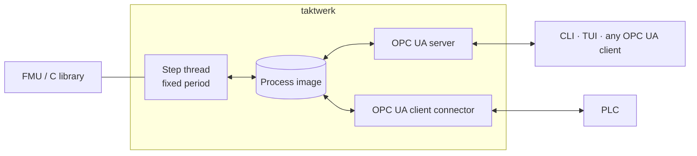

# taktwerk

Runs compiled models (FMI co-simulation FMUs or plain C libraries) at a fixed step on Linux,
beside or on a PLC. The engine owns a process image, serves it over its own OPC UA server, and
syncs it with other systems through connectors.

Not released yet. Design: [DESIGN.md](DESIGN.md).

Licensed under either of [MIT](LICENSE-MIT) or [Apache-2.0](LICENSE-APACHE) at your option.
