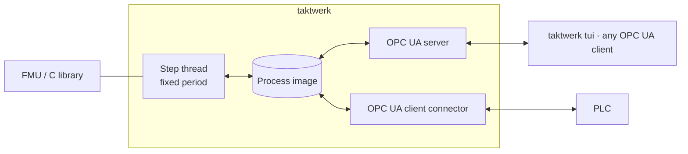

# taktwerk

Runs compiled models (FMI co-simulation FMUs or plain C libraries) at a fixed step on Linux,
beside or on a PLC. The engine owns a process image, serves it over its own OPC UA server, and
syncs it with other systems through connectors.

**Guide:** [labinetix.github.io/taktwerk](https://labinetix.github.io/taktwerk/), for users
and model developers.



## Getting started

```sh
cargo install taktwerk                   # or, from a checkout: cargo build --release

taktwerk inspect plant.fmu --kind fmi    # dimensions, variables, shapes
taktwerk new plant.fmu --kind fmi -o plant.toml
taktwerk check plant.toml                # load, resolve, bind; prints the plan
taktwerk run plant.toml                  # until SIGINT or SIGTERM
taktwerk tui opc.tcp://127.0.0.1:4840    # watch signals, edit inputs and tunables
```

A C library becomes a model package with `taktwerk import-header model.h -o
taktwerk-model.toml`, confirmed by hand, and leaves as a standard FMI 3 FMU with
`taktwerk fmu-wrap`. Runnable projects: [examples](examples/) (an FMU, a C
controller, both in one loop, and a systemd unit).

Not released yet. Design: [DESIGN.md](DESIGN.md).

Licensed under either of [MIT](LICENSE-MIT) or [Apache-2.0](LICENSE-APACHE) at your option.
